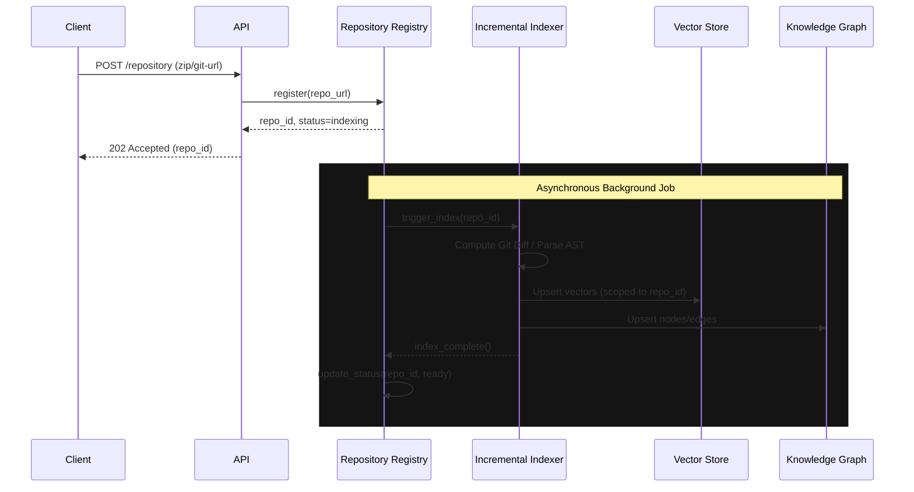
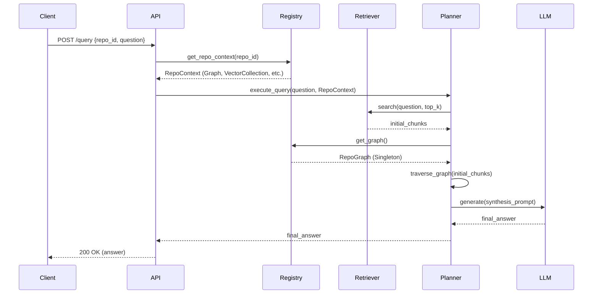

# Sequence Diagrams

## 1. Repository Ingestion Sequence

```mermaid
sequenceDiagram
    participant Client
    participant API
    participant Registry as Repository Registry
    participant Indexer as Incremental Indexer
    participant Qdrant as Vector Store
    participant Graph as Knowledge Graph
    
    Client->>API: POST /repository (zip/git-url)
    API->>Registry: register(repo_url)
    Registry-->>API: repo_id, status=indexing
    API-->>Client: 202 Accepted (repo_id)
    
    rect rgb(20, 20, 20)
        Note over Registry,Graph: Asynchronous Background Job
        Registry->>Indexer: trigger_index(repo_id)
        Indexer->>Indexer: Compute Git Diff / Parse AST
        Indexer->>Qdrant: Upsert vectors (scoped to repo_id)
        Indexer->>Graph: Upsert nodes/edges
        Indexer-->>Registry: index_complete()
        Registry->>Registry: update_status(repo_id, ready)
    end
```

## 2. Query Execution Sequence

```mermaid
sequenceDiagram
    participant Client
    participant API
    participant Registry
    participant Retriever
    participant Planner
    participant LLM
    
    Client->>API: POST /query {repo_id, question}
    API->>Registry: get_repo_context(repo_id)
    Registry-->>API: RepoContext (Graph, VectorCollection, etc.)
    
    API->>Planner: execute_query(question, RepoContext)
    
    Planner->>Retriever: search(question, top_k)
    Retriever-->>Planner: initial_chunks
    
    Planner->>Registry: get_graph()
    Registry-->>Planner: RepoGraph (Singleton)
    Planner->>Planner: traverse_graph(initial_chunks)
    
    Planner->>LLM: generate(synthesis_prompt)
    LLM-->>Planner: final_answer
    
    Planner-->>API: final_answer
    API-->>Client: 200 OK (answer)
```
